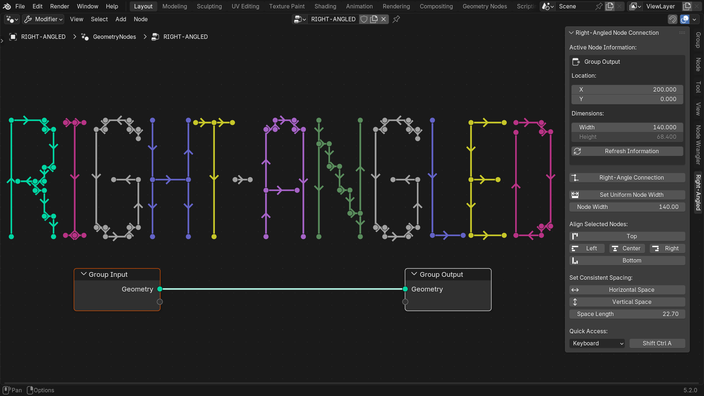
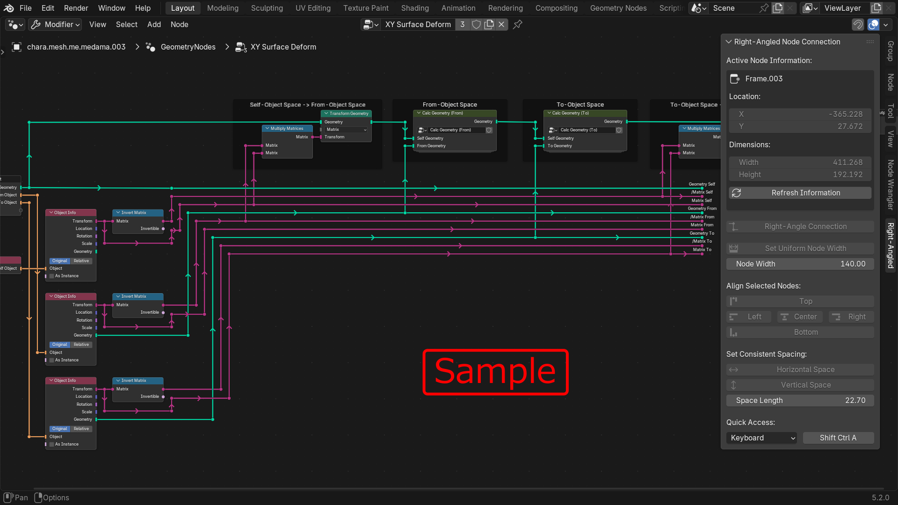
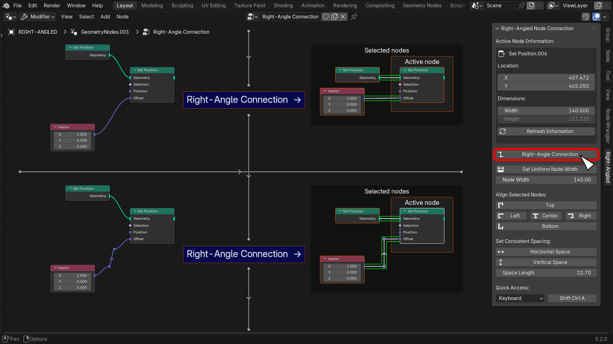
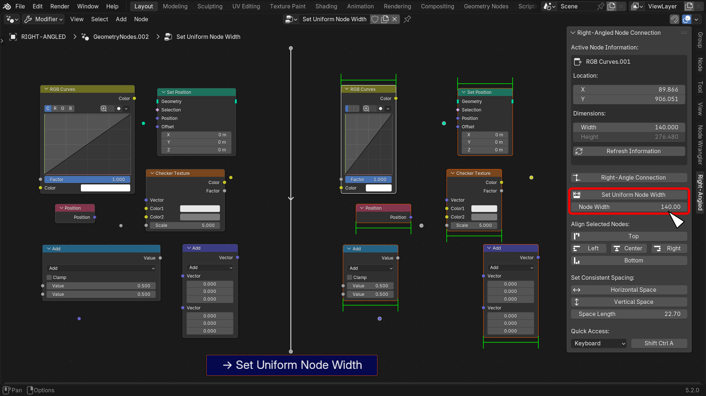
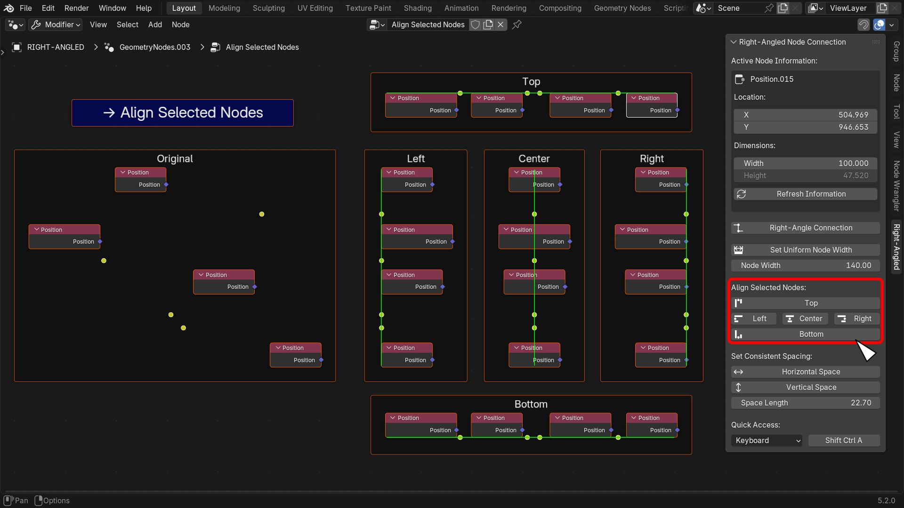
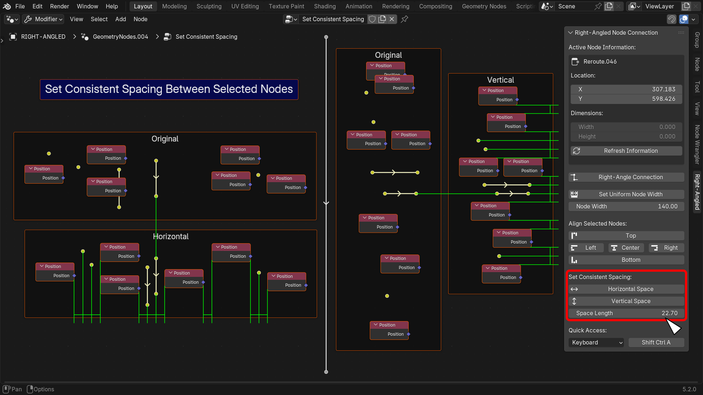
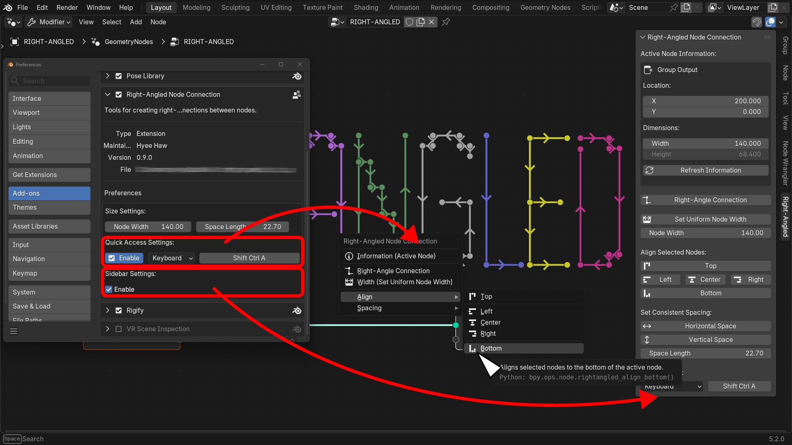

# Blender Add-on: Right-Angled Node Connection

## Overview

This Blender add-on provides tools for creating right-angled connections between nodes.
It includes the following features:

- Right-Angle Connection
- Set Uniform Node Width
- Align Selected Nodes
- Set Consistent Spacing Between Selected Nodes

This might be useful for people who prefer right-angled wiring connections,
such as electrical schematic design engineers.

## Requirements

Blender 4.2 LTS or newer.

## Usage

### Right-Angle Connection

Adjusts the positions of selected nodes relative to the active node
so that their connecting lines form straight horizontal segments.
However, if both ends of a connection are Reroute nodes,
the result may instead become a vertical line.

### Set Uniform Node Width

Sets the width of all selected nodes to the same value.
Nodes whose width cannot be changed, such as Reroute or Frame nodes, are ignored.

### Align Selected Nodes

Aligns the edges of the selected nodes with the active node.

Each node position is based on its top-left corner.
For best results,
use "Align-Left" to align the x-coordinates and "Align-Top" to align the y-coordinates.

### Set Consistent Spacing Between Selected Nodes

Adjusts the selected nodes, excluding the active node,
so that the gap between neighboring nodes remains a constant value.

Spacing is applied wherever node positions differ.
Nodes with the same x-coordinate are aligned vertically,
while nodes with the same y-coordinate are aligned horizontally.

### Preferences

Several settings are available under Edit > Preferences... > Add-ons.

- You can configure the shortcut key used to open the pop-up menu,
  or disable the shortcut entirely.
- You can hide the Node Editor's side panel.

## Limitations

At present, the Blender Python API does not provide a way to retrieve the
location of a node socket.
For this reason, the add-on uses a nonstandard, tricky approach to obtain it.

The values obtained this way appear to be rounded at some stage.
As a result, connection lines do not always align perfectly horizontally,
and moving nodes may introduce additional misalignment.

## Reference

[Blender Extensions](https://extensions.blender.org/) -
[Node Align (节点对齐)](https://extensions.blender.org/add-ons/node-align/)
: How to get the location of a node sockets.

## Author

Hyee Haw ([X: @hyee_haw](https://x.com/hyee_haw))

## License

This project is licensed under the GNU General Public License v3.0 or later.
See the [LICENSE](LICENSE) file for details.

Copyright (C) 2026 Hyee Haw

